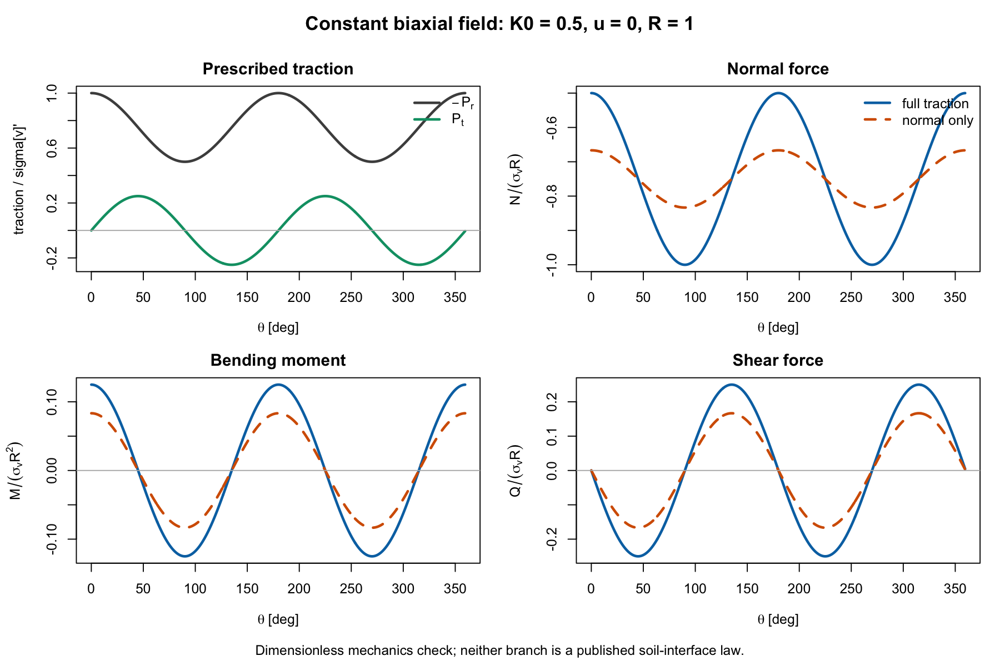
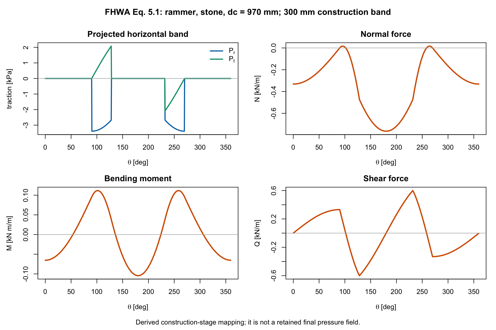

# Metodología preliminar para un anillo circular enterrado

## Estado y alcance

Este documento define una metodología auditable para calcular los resultantes
por unidad de longitud longitudinal de un anillo circular:

$$
N(\theta),\qquad M(\theta),\qquad Q(\theta),
$$

a partir de tracciones perimetrales normales y tangenciales prescritas:

$$
P_r(\theta),\qquad P_t(\theta).
$$

El cálculo es agnóstico al diámetro, la tapada y el espesor del caso real. La
geometría y las propiedades conocidas se incorporan como entradas. En esta
fase se resuelve un anillo circular, elástico y geométricamente lineal. Para
una corrugación anular, el problema plano no requiere inicialmente una
constitución ortótropa bidimensional: la dirección activa se representa por
las propiedades clásicas de la sección corrugada por unidad de longitud axial
proyectada,

$$
A_p,\qquad I_p,\qquad K_N=E_sA_p,\qquad K_M=E_sI_p.
$$

El cociente que interviene en el cierre del anillo es

$$
\eta=\frac{K_M}{K_NR^2}=\frac{I_p}{A_pR^2},
$$

y coincide con la entrada `sectionRatio` del solver directo vigente. La
corrugación se incorpora mediante esas propiedades antes de resolver; no como
una corrección posterior de $N$, $M$ o $Q$.

El dominio global es estrictamente plano: geometría homogenizada, cargas y
respuesta son invariantes en la coordenada longitudinal $x$, de modo que
$\partial(\,\cdot\,)/\partial x=0$.

La incorporación seccional vigente conecta perfil y espesor con $A_p$, $I_p$,
$E_sA_p$, $E_sI_p$ y $\eta$. El solver directo y el comparador Fourier usan el
mismo $\eta$; las ramas de interacción conservan las rigideces absolutas cuando
su formulación las requiere. Las propiedades y los resultados de control se
registran en [`benchmarks/corrugated-section.csv`](benchmarks/corrugated-section.csv)
y [`benchmarks/corrugated-k0-extrema.csv`](benchmarks/corrugated-k0-extrema.csv).

El producto del prototipo termina en $N(\theta)$, $M(\theta)$, $Q(\theta)$,
sus extremos y sus envolventes. No incluye desplazamientos como producto de
aceptación, ni la recuperación de $\sigma$, $\tau$, tensiones locales,
capacidades o demandas de pernos. La definición posterior de los estados
$\sigma_*$ y $\tau_*$ y de sus direcciones de verificación es una etapa
separada.

Se distinguen tres niveles de evidencia:

- **[PUBLICADO]**: ecuación, tabla o resultado reproducido de una fuente.
- **[DERIVADO]**: transformación matemática explícita realizada en esta
  metodología.
- **[SUPUESTO DEL ANALISTA]**: decisión que requiere justificación para cada
  aplicación.

La conclusión central de la revisión es la siguiente:

> USACE aporta una demanda anular escalar; FHWA aporta propiedades de relleno,
> una carga de compactación por etapa y benchmarks de interacción; Núñez aporta
> resultantes puntuales de túneles excavados. Ninguna de esas tres fuentes
> publica por sí sola una ley general de presión final
> $\{P_r(\theta),P_t(\theta)\}$ para una tubería colocada y rellenada.

Por ello, la metodología separa rigurosamente:

1. la estimación del estado de tensiones o de la acción constructiva;
2. su conversión, cuando está justificada, a tracciones sobre el anillo;
3. la solución mecánica del anillo;
4. la propagación de incertidumbre.

## 1. Convenciones, unidades y geometría

### 1.1 Convención canónica del solver

| Símbolo | Definición |
|---|---|
| $R$ | radio medio del anillo |
| $H_0$ | tapada vertical sobre la clave |
| $\theta_R$ | ángulo del solver: 0 en clave, horario positivo |
| $P_r>0$ | tracción radial hacia afuera |
| $P_t>0$ | tracción tangencial en el sentido creciente de $\theta_R$ |
| $N_R>0$ | fuerza circunferencial a tracción; compresión si $N_R<0$ |
| $M_R,Q_R$ | momento y corte con los signos de las ecuaciones de §4 |
| $A_w,I_w$ | área y momento de inercia de pared por unidad longitudinal |
| $k_w$ | cociente de sección $I_w/(A_wR^2)$ |

En el bloque de tracciones prescritas se omite el subíndice $R$ para no
recargar las ecuaciones. Las funciones fuente-nativas Schwartz–Einstein y
CANDE conservan otra coordenada: $\theta_S=0$ en el arranque derecho y sentido
antihorario. No se convierten signos automáticamente.

### 1.2 Símbolos que cambian entre fuentes

| Símbolo específico | Significado; no confundir con |
|---|---|
| $H_{USACE}$ | tapada sobre clave del ejemplo D4; no $H_N=H_0+R$ |
| $H_N$ | profundidad de eje en Núñez; para un círculo, $H_N=H_0+R$ |
| $H_C$ | tapada CANDE sobre la clave; en la geometría canónica, $H_C=H_0$ |
| $P_{SE}$ | tensión vertical inicial al nivel del eje en Schwartz–Einstein |
| $K_{SE}$ | razón fuente-nativa entre tensión horizontal y vertical iniciales; $\sigma_{h,SE}=K_{SE}P_{SE}$ |
| $A_N=a_N/(1+a_N)$ | factor de interacción Núñez; no área $A_w$ |
| $\alpha_C,\beta_C$ | rigideces relativas CANDE; no semiángulo de Baker |
| $\alpha_B$ | semiángulo del parche Baker, en radianes en las fórmulas |
| $P_m$ | presión media del tensor; no fuerza $P_c$ del compactador |
| $P_c$ | fuerza total del compactador FHWA |
| $P_B$ | resultante del parche Baker |
| $b_B$ | ancho longitudinal del anillo Baker |
| $\chi_N$ | factor de contacto de Núñez |

### 1.3 Unidades y conversión de signos

Las variables se expresan por unidad de longitud longitudinal del conducto. El
código es dimensionalmente homogéneo, pero no convierte unidades. Por ejemplo,
si las tensiones se ingresan en kPa $=\mathrm{kN/m^2}$ y $R$ en m, entonces:

$$
[N]=[Q]=\mathrm{kN/m},
\qquad
[M]=\mathrm{kN\,m/m}.
$$

El ejemplo USACE D4 se conserva deliberadamente en lb y ft y no debe mezclarse
con una rama SI sin una conversión explícita.

| Fuente/salida | Signo publicado | Conversión al solver canónico |
|---|---|---|
| Baker | $N<0$ bajo compresión | compatible con $N_R>0$ a tracción |
| USACE $T_L$ | empuje positivo a compresión | surrogate uniforme: $N_R=-T_L$ |
| FHWA/Burns–Richard | empuje positivo a compresión | si se mapea: $N_R=-T$ |
| Núñez | $N_C,N_A,N_I>0$ a compresión | si se mapea: $N_R=-N_{Núñez}$ |
| Schwartz–Einstein | `thrust` positivo a compresión, $\theta_S$ | transformación completa a $N_R,M_R,Q_R$: **UNKNOWN** |
| CANDE tabla 1.1.1-1 | signos algebraicos; sentido físico no definido en las páginas auditadas | transformación física: **UNKNOWN** |

Núñez 2000 expresa algunos ejemplos en tonelada-fuerza:
$1\ \mathrm{Tn}=9.80665\ \mathrm{kN}$. Los CSV preservan la unidad original;
cualquier comparación SI debe aplicar esta conversión explícitamente.

Si $H_0$ es la tapada vertical sobre la clave, la profundidad de un punto del
perímetro es

$$
z(\theta)=H_0+R\left(1-\cos\theta\right).
$$

Las profundidades de control son

$$
z_C=H_0,\qquad z_A=H_0+R,\qquad z_I=H_0+2R.
$$

## 2. Tensiones verticales, agua y $K_0$

### 2.1 Tensión vertical efectiva

**[DERIVADO DE EQUILIBRIO GEOSTÁTICO 1D]** Para un perfil estratificado, con
sobrecarga efectiva uniforme $q'$ y pesos
unitarios efectivos $\gamma'_j$, la tensión vertical efectiva a profundidad
$z$ se evalúa como

$$
\sigma'_v(z)=q'+\sum_j \gamma'_j\,\Delta z_j(z),
$$

donde $\Delta z_j(z)$ es la parte de la capa $j$ comprendida entre la
superficie y $z$.

Si el nivel freático se encuentra a profundidad $z_w$, la presión de poros
hidrostática es

$$
u(z)=\gamma_w\max(0,z-z_w),
$$

y la tensión vertical total es

$$
\sigma_v(z)=\sigma'_v(z)+u(z).
$$

La función R `ringVerticalStressOrdinates()` calcula explícitamente los valores
en clave, eje y solera. Esos tres valores son controles de entrada; no implican
que el gradiente pueda aplicarse sin más a un anillo libre.

### 2.2 Definición y estimación de $K_0$

**[PUBLICADO]** Por definición,

$$
K_0=\frac{\sigma'_h}{\sigma'_v}.
$$

La guía FHWA NHI-05-037, §5.4.9, p. impresa 5-83/PDF 261, presenta
dos estimaciones habituales:

$$
K_0=\frac{\nu}{1-\nu}
\tag{elasticidad confinada}
$$

y, para suelos no cohesivos o cohesivos normalmente consolidados, la relación
de Jaky

$$
K_{0,NC}=1-\sin\phi'.
\tag{Jaky}
$$

La misma guía advierte que la sobreconsolidación y las trayectorias de carga,
descarga y recarga —incluida la compactación— pueden elevar $K_0$. Jaky se
presenta como correlación para material no cohesivo o cohesivo normalmente
consolidado, no como ley universal de un relleno compactado. La Ec. 5.39 del
PDF recuperado presenta una transcripción ambigua frente a la formulación
original de Mayne–Kulhawy; por ello no se codifica ni se usa para fijar un
rango hasta auditar esa fuente primaria.

Fuente local: [FHWA NHI-05-037](sources/fhwa_nhi_05_037_geotechnical_aspects_pavements.pdf),
Ecs. 5.36–5.39, p. impresa 5-83/PDF 261; integridad registrada en
[MANIFEST.md](MANIFEST.md).

Consecuencias para el problema actual:

- `k0NormallyConsolidated()` implementa únicamente la relación de Jaky;
- `k0ElasticConfined()` implementa únicamente la relación elástica confinada;
- esa relación no representa por sí sola un relleno compactado desconocido;
- el factor LRFD 1.35 que aparece en la tabla 4-4 de USACE para presión
  horizontal en reposo **no es** un valor de $K_0$;
- mientras no exista información del relleno, la distribución probabilística
  de $K_0$ es **UNKNOWN** y debe especificarse como hipótesis de análisis, no
  deducirse de las fuentes de cargas.

### 2.3 Incremento horizontal de compactación

Para una rama simplificada de estado final puede escribirse

$$
\sigma'_h=K_0\sigma'_v+\Delta\sigma'_{h,c},
$$

donde $\Delta\sigma'_{h,c}$ es un incremento horizontal residual. Este término
es **[SUPUESTO DEL ANALISTA]** hasta contar con una medición o un modelo de
retención. No debe superponerse automáticamente con la presión de compactación
FHWA de la etapa constructiva; hacerlo puede contar dos veces el mismo efecto.

## 3. Del tensor de tensiones a las tracciones del anillo

### 3.1 Campo biaxial constante al nivel del eje

**[SUPUESTO DEL ANALISTA]** La línea base equilibrada reemplaza el campo
variable en profundidad por un tensor total constante evaluado al nivel del
eje. Se define

$$
\sigma'_h=K_0\sigma'_v+\Delta\sigma'_{h,c},
$$

$$
P_m=u+\frac{\sigma'_v+\sigma'_h}{2},
\qquad
\Delta=\sigma'_v-\sigma'_h.
$$

La proyección completa del tensor sobre el perímetro es **[DERIVADO]**:

$$
P_r(\theta)=-P_m-\frac{\Delta}{2}\cos 2\theta,
$$

$$
P_t(\theta)=\frac{\Delta}{2}\sin 2\theta.
\tag{rama `fullTraction`}
$$

Para estudiar la sensibilidad a una interfaz que no transmite corte se define
una segunda rama:

$$
P_r(\theta)=-P_m-\frac{\Delta}{2}\cos 2\theta,
\qquad
P_t(\theta)=0.
\tag{rama `normalOnly`}
$$

Estas dos ramas son idealizaciones límite de transferencia de tracción. No son
dos leyes de interfaz publicadas por USACE, FHWA o CANDE. Si no existe un modelo
mejor, deben informarse por separado y no promediarse.



### 3.2 Por qué no se usa directamente $\sigma_v(z(\theta))$

Una distribución geostática variable con la profundidad puede producir una
resultante vertical neta cuando se aplica como presión sobre un anillo libre.
En la estructura real esa resultante se equilibra mediante el suelo de apoyo,
el contacto en solera y el resto del continuo. Si esos mecanismos no están
incluidos, imponer sólo la presión variable viola el equilibrio global.

Por ello:

- la línea base usa el tensor constante al eje, que es globalmente equilibrado;
- los valores de clave y solera se conservan como ordenadas de control y para
  análisis de sensibilidad;
- una rama con gradiente perimetral requiere definir simultáneamente la reacción
  de apoyo/contacto;
- el solver R rechaza por defecto toda carga no equilibrada.

Esta restricción es de mecánica, no una limitación numérica.

## 4. Solución del anillo circular

### 4.1 Ecuaciones de equilibrio

**[PUBLICADO + DERIVADO]** Baker publica para carga radial las Ecs. 2-1a–c
(p. impresa 16/PDF 20). El término $RP_t$ se obtiene por equilibrio del mismo
elemento diferencial; Schwartz–Einstein publica la forma con tracción radial
y tangencial en su Ec. A.42 (p. impresa 366/PDF 382), con otra notación y
convención. En la convención canónica y usando prima para $d/d\theta_R$:

$$
N'-Q+R P_t=0,
$$

$$
Q'+N-R P_r=0,
$$

$$
M'-RQ=0.
$$

El problema es lineal. Cualquier combinación de cargas equilibradas puede
resolverse por superposición.

### 4.2 Cierre de compatibilidad

**[DERIVADO DE BAKER 1968]** El equilibrio deja tres constantes homogéneas. La
solución homogénea es

$$
N_h=a\cos\theta+b\sin\theta,
$$

$$
Q_h=-a\sin\theta+b\cos\theta,
$$

$$
M_h=Ra\cos\theta+Rb\sin\theta+c.
$$

Baker define desplazamientos radial $w$ y tangencial $v$ y publica, bajo
**tensión plana**, la cinemática y las leyes de sección en sus Ecs. 2-3 a
2-6 (pp. impresas 16–17/PDF 20–21). Con $z$ medido desde la superficie media:

$$
\varepsilon_\theta(z)=
\frac{v'}{R}-\frac{z}{R(R+z)}w''+\frac{w}{R+z}.
$$

Al integrar la tensión elástica sobre una sección simétrica y conservar los
términos de la aproximación de anillo delgado de Baker:

$$
N=\frac{EA_w}{R}(v'+w)
  +\frac{EI_w}{R^3}(w''+w),
$$

$$
M=\frac{EI_w}{R^2}(w''+w).
$$

Estas ecuaciones muestran el rol de $EA_w$ y $EI_w$ en el cierre; el
equilibrio por sí solo no los determina. Como el operador $d^2/d\theta^2+1$
anula los armónicos rígidos $n=1$ de $w$, resulta

$$
\int_0^{2\pi}M\cos\theta\,d\theta=0,
\qquad
\int_0^{2\pi}M\sin\theta\,d\theta=0.
$$

Al promediar en una vuelta, $\overline{v'}=\overline{w''}=0$, de modo que

$$
\bar N=\frac{EA_w}{R}(1+k_w)\bar w,
\qquad
\bar M=\frac{EI_w}{R^2}\bar w.
$$

Por tanto, la tercera condición es

$$
\bar M=R\frac{k_w}{1+k_w}\bar N,
\qquad
k_w=\frac{I_w}{A_wR^2}.
$$

Para una tira rectangular de espesor $t$,

$$
k_w=\frac{t^2}{12R^2}.
$$

El valor por defecto `sectionRatio = 0` es el cierre membranal. Para una pared
corrugada anular se usan $A_w=A_p$, $I_w=I_p$ y
`sectionRatio = I_p/(A_p R^2)`. Esto incorpora la rigidez de la sección en el
cierre uniforme del modelo de anillo; no pretende representar una cáscara
ortótropa bidimensional.

CANDE Level 1 adopta teoría de pared delgada y su tabla conduce a
$\bar M=R(\beta_C/\alpha_C)\bar N=Rk_w\bar N$, sin el factor
$(1+k_w)^{-1}$. La diferencia entre ambos cierres es de orden $k_w^2$ y debe
mantenerse explícita; el código no fuerza la respuesta CANDE al formato del
solver directo. Para una chapa ondulada, $A_w$ e $I_w$ serán las propiedades
seccionales verificadas $A_p$ e $I_p$ por longitud proyectada.

### 4.3 Integración directa

**[IMPLEMENTACIÓN DERIVADA]** `solveRingDirect()` integra las tres ecuaciones
de equilibrio y las integrales
de compatibilidad mediante Runge–Kutta de cuarto orden. La malla incluye:

- los ángulos solicitados por el usuario;
- los puntos de discontinuidad declarados por cada carga;
- una malla base uniforme para controlar la integración.

En una discontinuidad, los extremos de cada subintervalo se evalúan desde el
interior. Así se evita contar el salto con valores pertenecientes a ambos
lados.

Antes de devolver una respuesta válida se verifican

$$
F_x=R\int_0^{2\pi}
\left(P_r\sin\theta+P_t\cos\theta\right)d\theta=0,
$$

$$
F_z=R\int_0^{2\pi}
\left(-P_r\cos\theta+P_t\sin\theta\right)d\theta=0,
$$

$$
M_c=R^2\int_0^{2\pi}P_t\,d\theta=0,
$$

y el cierre periódico de $N$, $Q$ y $M$. Para una carga no equilibrada, los
incrementos físicos esperados en una vuelta no son cero sino

$$
N(2\pi)-N(0)=-F_x,
$$

$$
Q(2\pi)-Q(0)=-F_z,
$$

$$
M(2\pi)-M(0)=M_c-RF_x.
$$

La solución particular integrada por el código parte de estado nulo; por eso
su valor final coincide con esos incrementos. El código compara primero las
resultantes globales con cero y luego el cierre numérico con estas identidades.
Así distingue `globalLoad` de
`integrationClosure` usando escalas compatibles. `allowUnbalanced = TRUE`
existe sólo para diagnóstico; `runRingMonteCarlo()` rechaza siempre una
respuesta inválida.

## 5. Solución cerrada del campo $K_0$

**[DERIVADO]** Integrar analíticamente las mismas ecuaciones y el mismo cierre
para los armónicos $n=0$ y $n=2$ produce una verificación independiente del
algoritmo RK4, no una validación física externa.

Este campo no es una aproximación truncada: la presión media pertenece a
$n=0$, la diferencia vertical--horizontal pertenece a $n=2$ y los demás
coeficientes son exactamente nulos. $n=1$ queda reservado a una resultante
global que exige reacción explícita; $n\ge3$ aparece sólo al introducir
variaciones perimetrales más localizadas. Fourier se conserva como comparador
modal, mientras la integración directa sigue siendo la ruta principal.

Sea

$$
N_0=-RP_m,
\qquad
M_0=R\frac{k_w}{1+k_w}N_0.
$$

Para la rama `fullTraction`:

$$
N(\theta)=N_0+\frac{R\Delta}{2}\cos2\theta,
$$

$$
M(\theta)=M_0+\frac{R^2\Delta}{4}\cos2\theta,
$$

$$
Q(\theta)=-\frac{R\Delta}{2}\sin2\theta.
$$

Para la rama `normalOnly`:

$$
N(\theta)=N_0+\frac{R\Delta}{6}\cos2\theta,
$$

$$
M(\theta)=M_0+\frac{R^2\Delta}{6}\cos2\theta,
$$

$$
Q(\theta)=-\frac{R\Delta}{3}\sin2\theta.
$$

Con $k_w=0$ y $\Delta\ge0$, los máximos absolutos son

| Rama | Compresión máxima $|N|$ | $|M|_{max}$ | $|Q|_{max}$ |
|---|---:|---:|---:|
| `fullTraction` | $R(P_m+\Delta/2)$ | $R^2\Delta/4$ | $R\Delta/2$ |
| `normalOnly` | $R(P_m+\Delta/6)$ | $R^2\Delta/6$ | $R\Delta/3$ |

Para `fullTraction`, la compresión máxima ocurre en los arranques; el momento
alcanza magnitud máxima en clave, solera y arranques, con signo alternado; el
corte máximo ocurre a $45^\circ$, $135^\circ$, $225^\circ$ y $315^\circ$.

Estas expresiones muestran directamente la sensibilidad:

- aumentar la tapada aumenta aproximadamente en forma lineal $P_m$ y $\Delta$;
- reducir $K_0$ aumenta $\Delta$ y, por tanto, $|M|$ y $|Q|$;
- el agua añade presión isotrópica a $P_m$: aumenta la compresión uniforme, pero
  no $M$ ni $Q$ en este modelo;
- **sólo en la rama residual tensorial uniforme**, un incremento horizontal de
  compactación aumenta $\sigma'_h$, reduce $\Delta$ y puede reducir o invertir
  el patrón de flexión. La banda localizada FHWA representa *peaking* durante
  la colocación lateral y puede aumentar momentos; no tiene esta conclusión.

En el límite hidrostático o isotrópico, $\Delta=0$:

$$
N=-RP_m,\qquad M=M_0,\qquad Q=0.
$$

Con el cierre membranal, $M_0=0$. Ésta es la diferencia esencial entre agua y
un estado de suelo anisótropo: el agua produce compresión uniforme; la
diferencia $\sigma'_v-\sigma'_h$ produce flexión y corte.

## 6. Qué aporta cada fuente de cargas

### 6.1 USACE 2020: empuje anular escalar

**[PUBLICADO]** Para tubería metálica corrugada, USACE EM 1110-2-2902,
ecuación 4-20 (p. impresa 86/PDF 100), da

$$
T_L=\gamma_{DL}\left(\frac{P_{FD}S}{2}\right)
   +\gamma_{LL}\left(\frac{P_{FL}C_LF_1}{2}\right).
$$

$T_L$ es empuje factorizado por unidad de longitud. La ecuación no publica
$P_r(\theta)$, $P_t(\theta)$, $M(\theta)$ ni $Q(\theta)$.

El ejemplo D4 corresponde a una tubería de aluminio corrugado; es un benchmark
aritmético del procedimiento, no un caso idéntico de acero. El apéndice llama
“4-24” a la ecuación que el cuerpo numera 4-20. Usa

$$
S=3\ \mathrm{ft},\quad H_{USACE}=30\ \mathrm{ft},
\quad \gamma=120\ \mathrm{lb/ft^3},
$$

$$
P_{FD}=\gamma H_{USACE}=3600\ \mathrm{lb/ft^2},
$$

$$
T_L=1.95\frac{3600\times3}{2}
=10530\ \mathrm{lb/ft},
$$

y aplica 1.10 para obtener

$$
T_d=11583\ \mathrm{lb/ft}.
$$

La fuente contiene dos contradicciones que el código obliga a resolver de modo
explícito:

- tabla 4-4: 1.50 para presión vertical CMP; ecuación 4-20 y D4: 1.95;
- ecuación 4-21: 1.05; ejemplo D4: 1.10.

`usaceCmpThrust()` exige que el analista ingrese los factores y documente su
base. No selecciona un valor silenciosamente.

Una carga uniforme equivalente es **[DERIVADO]**:

$$
p_{eq}=\frac{T_L}{R},
\qquad
P_r=-p_{eq},\qquad P_t=0.
$$

Produce $N=-T_L$ y $M=Q=0$. Sirve para comparar el empuje escalar, no para
atribuir a USACE una distribución angular que no publicó. La rama USACE
factorizada y la rama geostática de servicio deben compararse o desagregarse;
no deben sumarse automáticamente.

Fuente local: [USACE EM 1110-2-2902](sources/usace_em_1110_2_2902_2020.pdf).

### 6.2 FHWA 1999: rigidez del relleno y compactación por etapa

FHWA-RD-98-191 no publica una presión perimetral final universal. Aporta tres
elementos útiles.

#### Rigidez restringida

**[PUBLICADO]** La tabla 3.6 (pp. impresas 70-71/PDF 86-87) tabula el módulo
restringido secante $M_s$ para suelos SW, ML y CL, compactaciones 85, 90 y 95,
y seis niveles de tensión. Los valores exactos están en
[`benchmarks/fhwa-constrained-modulus.csv`](benchmarks/fhwa-constrained-modulus.csv).

Los porcentajes son densidades relativas a la densidad máxima del ensayo
Standard Proctor. La serie publicada no debe suavizarse automáticamente: por
ejemplo, ML al 90 % baja de 5.86 a 5.45 MPa entre 70 y 140 kPa. Esa
no-monotonicidad debe conservarse o reemplazarse mediante una decisión de
modelo documentada.

$M_s$ condiciona la interacción suelo-estructura en Burns–Richard/CANDE, pero
no determina por sí solo $K_0$ ni una presión angular.

#### Presión equivalente de compactación

**[PUBLICADO]** La ecuación 5.1, sólo en SI, es

$$
n_p=1.3P_c(1-\sin\phi)^3
\left(\frac{970}{d_c-250}\right)^2,
$$

donde:

- $n_p$: kPa;
- $P_c$: fuerza total del compactador en kN, con mínimo 4 kN;
- $\phi$: ángulo de fricción del suelo suelto, en grados;
- $d_c$: diámetro centroidal, en mm.

La correlación fue desarrollada con datos limitados como “Método 3”, el menos
sofisticado de los tres evaluados. Sus fuerzas nodales se calibraron para
reproducir deflexiones de ensayos; no es un modelo constitutivo de
compactación. Representa fuerzas horizontales aplicadas a una banda de 300 mm
debajo de la superficie de la tongada durante la construcción; no es una
medición de presión residual.

Límites de uso publicados o detectados al reproducir la tabla 5.5:

- el modelo 2D aplica la acción simultáneamente sobre longitud longitudinal
  infinita; FHWA advierte que una fuerza concentrada 3D real sería mayor;
- deben usarse diámetros **centroidales** de 970 y 1575 mm, no los nominales
  900 y 1500 mm;
- la última fila imprime piedra con $\phi=28^\circ$, pero $0.2$ kPa se
  reproduce con $36^\circ$; la discrepancia queda anotada en el CSV;
- la ecuación es singular en $d_c=250$ mm y la fuente no publica un dominio
  general para extrapolar fuera de sus casos.

Tabla reproducible:
[`benchmarks/fhwa-equation-5-1.csv`](benchmarks/fhwa-equation-5-1.csv).

La transformación al anillo es **[DERIVADO]**. Si $h_l$ es la profundidad de
la superficie de la tongada medida desde la clave,

$$
\mathcal B(\theta)=
\begin{cases}
1,&h_l\le R(1-\cos\theta)\le h_l+0.300\ \mathrm{m},\\
0,&\text{en otro caso},
\end{cases}
$$

$$
H_x(\theta)=-n_p\,\operatorname{sign}(\sin\theta)\,\mathcal B(\theta),
$$

$$
P_r=H_x\sin\theta,
\qquad
P_t=H_x\cos\theta.
$$

La pareja es simétrica y equilibrada. El código incluye los cruces de la banda
y la solera como discontinuidades exactas de integración.



La retención total o parcial de $n_p$ al final de la construcción es
**[SUPUESTO DEL ANALISTA]**.

#### Predicciones analíticas Burns–Richard, interfaz full-slip

**[PUBLICADO]** La tabla 5.1 (pp. impresas 166-167/PDF 181-182)
compara predicciones y datos para varios conductos. Los números siguientes son
las columnas de **predicción analítica full-slip** para una tubería metálica de
900 mm; no son mediciones de campo:

| $M_s$ (MPa) | $S_B$ | $S_H$ | $p_C$ (kPa) | $p_A$ (kPa) | $N_A$ (kN/m) | $M_C$ (kN m/m) | $M_A$ (kN m/m) | VAF |
|---:|---:|---:|---:|---:|---:|---:|---:|---:|
| 3.5 | 57 | 0.005 | 27 | 19 | 11.39 | -0.289 | 0.288 | 1.05 |
| 16 | 260/261 | 0.022 | 24 | 22 | 10.84 | -0.077 | 0.076 | 1.00 |

La parte A imprime $S_B=260$ y la parte B, 261. La discrepancia se conserva en
[`benchmarks/fhwa-burns-richard-metal.csv`](benchmarks/fhwa-burns-richard-metal.csv).

$S_B$ es la razón de rigidez flexional, $S_H$ la razón de rigidez
circunferencial y VAF el factor de arqueo vertical de la fuente. Los subíndices
$C$ y $A$ se usan aquí para clave y arranque; el renombrado está documentado
para evitar confundir $A$ con área. $N_A$ es empuje positivo a compresión y se
convertiría como $N_R=-N_A$ en el solver canónico.

Para el tubo metálico, FHWA indica que las deformaciones de empuje no fueron
analizadas: no existe en esa tabla un $N_A$ medido que valide 11.39 o
10.84 kN/m. La comparación corresponde además al **incremento** producido por
el relleno colocado sobre la corona, no a toda la historia constructiva.

Fuente local: [FHWA-RD-98-191](sources/fhwa_1999_pipe_interaction_backfill_envelope.pdf).

### 6.3 Núñez 2000 y Núñez–Sfriso–Laiún 2014

Núñez estudia sostenimientos de túneles excavados, principalmente NATM en
suelos pampeanos rígidos. El coeficiente $\eta$ representa relajación por
excavación y avance del frente. No representa compactación de un relleno.

En esta sección $H_N$ es la profundidad desde superficie hasta el **eje**; para
la geometría circular general, $H_N=H_0+R$. La fuente recomienda
$\eta_N=1/3$–$2/3$ para soporte primario y $\eta_N=1$ para el revestimiento
permanente. Su Ec. 8 contiene una ambigüedad de signo y de definición de la
distancia $d$; por ello la ley que pretende calcular $\eta_N(d)$ no se
automatiza.

#### Interacción y rigidez

Con módulos de deformación plana

$$
E_{r0}=\frac{E_r}{1-\nu_r^2},
\qquad
E_{s0}=\frac{E_s}{1-\nu_s^2},
$$

la forma algebraicamente consistente del parámetro es **[DERIVADO]**:

$$
a_N=\frac{16}{\chi_N}\frac{E_{r0}}{E_{s0}}
\left(\frac{e}{D}\right)^3,
\qquad
A_N=\frac{a_N}{1+a_N}.
$$

Núñez recomienda $\chi_N=1$ para contacto suave/soporte primario y
$\chi_N=2$ para contacto rugoso/revestimiento permanente. Estos valores
pertenecen al dominio NATM de la fuente, no a la interfaz de una tubería
rellenada.

La ecuación 20 de 2014 vuelve a multiplicar por una corrección de Poisson y la
aplica dos veces. `nunezInteractionRatio()` usa una sola corrección. La ecuación
15 también contiene una inconsistencia 6/12 en el desplazamiento radial. Estas
correcciones no deben ocultarse como si fueran transcripciones literales.

#### Reducción circular seca basada en Núñez 2000

**[DERIVADO]** El artículo de 2000 desarrolla una formulación
elíptica/hidráulica. La reducción circular seca legible usada para reproducir
sus ejemplos define

$$
p_d=\eta_N(1-K_0)(\gamma H_N+q),
\qquad
p_h=\frac{p_d}{1+a_N}.
$$

Las expresiones reducidas son

$$
M_C=\frac{p_dD^2}{16}\frac{a_N}{1+a_N},
$$

$$
N_C=\frac{D}{2}\left(K_0p_d+p_h\right),
$$

$$
N_A=\frac{D}{2}\left(\eta_N\gamma H_N+q\right).
$$

En la última expresión, 2000 deja $q$ fuera de $\eta$. Esa ubicación cambia en
2014 y no debe armonizarse silenciosamente.

#### Versión 2014

**[PUBLICADO]** Con compresión positiva y $H_N$ medido al eje:

$$
M_{max}=\frac{1}{16}\eta_N(1-K_0)(\gamma H_N+q)D^2
\frac{a_N}{1+a_N},
$$

$$
N_A=\frac{1}{2}\eta_N D(\gamma H_N+q),
$$

$$
N_C=\frac{1}{2}\eta_N D(\gamma H_N+q)
\left[K_0+\frac{2}{3}\frac{1-K_0}{1+a_N}\right]
-\frac{1}{12}K_0\gamma D^2,
$$

$$
N_I=\frac{1}{2}\eta_N D(\gamma H_N+q)
\left[K_0+\frac{4}{3}\frac{1-K_0}{1+a_N}\right]
+\frac{1}{12}K_0\gamma D^2.
$$

La fuente no publica $P_r(\theta)$, $P_t(\theta)$ ni $Q(\theta)$. El código
devuelve primero esos escalares mediante `nunez2014Resultants()`.

Una carga tensorial equivalente se ofrece sólo como **[DERIVADO]**. Reproduce:

- $M_{max}$;
- $N_A$;
- el promedio de $N_C$ y $N_I$.

No reproduce la diferencia clave–solera ni un $Q(\theta)$ publicado, porque
éste no existe. El solver exige para esta equivalencia $R=D/2$ y
`sectionRatio = 0`.

**[DERIVADO]** Recalcular ambas versiones con las mismas entradas revela por
qué deben mantenerse separadas. No todos los números siguientes están
impresos en 2000; la tabla es una comparación aritmética del proyecto:

| Caso | Magnitud | 2000 | 2014 con las mismas entradas |
|---|---:|---:|---:|
| primario | $M$ (Tn m/m) | 1.2118 | 1.2118 |
| primario | $N_C$ (Tn/m) | 54.343 | 52.895 |
| primario | $N_A$ (Tn/m) | 76.25 | 73.75 |
| permanente | $M$ (Tn m/m) | 9.1177 | 9.1177 |
| permanente | $N_C$ (Tn/m) | 103.331 | 110.137 |
| permanente | $N_A$ (Tn/m) | 147.5 | 147.5 |

Archivo reproducible:
[`benchmarks/nunez-version-difference.csv`](benchmarks/nunez-version-difference.csv).

**[PUBLICADO, NO REPRODUCIBLE CON LAS ENTRADAS DISPONIBLES]** La tabla 3 de
2014 compara solución cerrada (“A”) con FEM; no son mediciones:

| Caso | $N_C$ A/FEM (kN/m) | $N_A$ A/FEM (kN/m) | $M_C$ A/FEM (kN m/m) | $M_A$ A/FEM (kN m/m) |
|---:|---:|---:|---:|---:|
| 1 | 620 / 740 | 670 / 615 | 4.8 / 2.2 | 5.9 / 6.5 |
| 2 | 365 / 380 | 450 / 385 | 1.5 / 0.5 | 1.6 / 1.6 |
| 3 | 720 / 500 | 680 / 780 | 10.2 / 10.0 | 13.8 / 65.0 |
| 4 | 1080 / 1070 | 1180 / 600 | 17.0 / 8.0 | 21.0 / 35.0 |
| 5 | 120 / 110 | 160 / 125 | 0.5 / 0.5 | 0.5 / 0.9 |
| 6 | 825 / 905 | 870 / 955 | 6.4 / 2.0 | 7.9 / 2.5 |
| 7 | 1070 / 985 | 1025 / 1235 | 18.0 / 6.9 | 24.2 / 67.0 |

Nunca se midieron las cargas estructurales y el paper no publica todas las
entradas necesarias para recalcular estos siete casos. Las discrepancias de
momento en los casos 3, 4 y 7 impiden presentar la tabla como validación
general. La concordancia de 10–15 % con Einstein–Schwartz que menciona el
paper se atribuye a trabajos previos y no se demuestra allí.

Archivo fiel a la tabla:
[`benchmarks/nunez-2014-analytical-fem.csv`](benchmarks/nunez-2014-analytical-fem.csv).

Fuentes locales:
[Núñez 2000](sources/nunez_2000_tunnel_support_loads.pdf) y
[Núñez, Sfriso y Laiún 2014](sources/nunez_sfriso_laiun_2014_tunnel_support_loads.pdf).

### 6.4 CANDE y Burns–Richard

CANDE es un programa y una metodología para análisis y diseño de conductos
enterrados. No es una biblioteca R/Python ni una sola ecuación.

- Nivel 1: extensión de la solución elástica cerrada de Burns–Richard;
- Nivel 2: elementos finitos con generación automática de malla y geometría
  restringida;
- Nivel 3: el mismo marco de elementos finitos con malla definida por el
  usuario.

Todos los niveles son bidimensionales y trabajan en deformación plana. El nivel
1 acopla un conducto cilíndrico elástico con un medio elástico, homogéneo,
isótropo e infinito. La entrada remota es una presión uniforme sobre planos
horizontales a distancia infinita,

$$
P_0=\gamma H_C.
$$

Aquí $H_C$ es la tapada sobre la clave; con la geometría canónica,
$H_C=H_0$.

**[PUBLICADO]** La tabla 1.1.1-1 (p. impresa 1-2/PDF 10) define

$$
K_C=\frac{\mu_g}{1-\mu_g},
\qquad
E_C=\frac{E_{pipe}}{1-\mu_{pipe}^2},
\qquad
\alpha_C=\frac{E_CA_w}{2GR},
\qquad
\beta_C=\frac{E_CI_w}{2GR^3}.
$$

$K_C$ está ligado al Poisson del suelo: muestrear un $K_0$ independiente y
seguir llamando a la rama “CANDE Level 1” cambia el modelo. $G$ es el módulo
de corte del suelo y $A_w,I_w$ son propiedades de pared por unidad
longitudinal.

Con interfaz adherida, defina

$$
D_b=(1+K_C)+3(5-K_C)\beta_C+(3+K_C)\alpha_C
    +12(3-K_C)\alpha_C\beta_C.
$$

Las tracciones de contacto calculadas son

$$
\frac{P_r}{P_0}=\frac{\alpha_C}{1+\alpha_C}
-\frac{(1-K_C)(-2\alpha_C+18\beta_C+24\alpha_C\beta_C)}{D_b}
\cos2\theta_S,
$$

$$
\frac{P_t}{P_0}=\frac{(1-K_C)(4\alpha_C+24\alpha_C\beta_C)}{D_b}
\sin2\theta_S.
$$

Los desplazamientos y resultantes son

$$
\frac{2Gu_r}{P_0R}=\frac{1}{1+\alpha_C}
-\frac{(1-K_C)(2+4\alpha_C)}{D_b}\cos2\theta_S,
$$

$$
\frac{2Gu_t}{P_0R}=\frac{(1-K_C)(2+2\alpha_C+6\beta_C)}{D_b}
\sin2\theta_S,
$$

$$
\frac{M}{P_0R^2}=\frac{\beta_C}{1+\alpha_C}
+\frac{(1-K_C)(6\beta_C+12\alpha_C\beta_C)}{D_b}\cos2\theta_S,
$$

$$
\frac{N}{P_0R}=\frac{\alpha_C}{1+\alpha_C}
+\frac{(1-K_C)(2\alpha_C+6\beta_C+24\alpha_C\beta_C)}{D_b}
\cos2\theta_S,
$$

$$
\frac{Q}{P_0R}=-\frac{(1-K_C)(12\beta_C+24\alpha_C\beta_C)}{D_b}
\sin2\theta_S.
$$

Con interfaz sin fricción,

$$
D_f=(1+K_C)+3(5-K_C)\beta_C,
$$

$$
\frac{P_r}{P_0}=\frac{\alpha_C}{1+\alpha_C}
-\frac{(1-K_C)18\beta_C}{D_f}\cos2\theta_S,
\qquad P_t=0,
$$

$$
\frac{2Gu_r}{P_0R}=\frac{1}{1+\alpha_C}
-\frac{2(1-K_C)}{D_f}\cos2\theta_S,
$$

$$
\frac{2Gu_t}{P_0R}=\frac{1-K_C}{D_f}\sin2\theta_S,
$$

$$
\frac{M}{P_0R^2}=\frac{\beta_C}{1+\alpha_C}
+\frac{6(1-K_C)\beta_C}{D_f}\cos2\theta_S,
$$

$$
\frac{N}{P_0R}=\frac{\alpha_C}{1+\alpha_C}
+\frac{6(1-K_C)\beta_C}{D_f}\cos2\theta_S,
$$

$$
\frac{Q}{P_0R}=-\frac{12(1-K_C)\beta_C}{D_f}\sin2\theta_S.
$$

La tabla no define explícitamente el sentido físico positivo de estas siete
respuestas. `candeLevel1Response()` conserva sus signos y $\theta_S$ de forma
fuente-nativa; no los mezcla automáticamente con `solveRingDirect()`.

**[DERIVADO]** Para $P_0=100$ kPa, $R=1$ m, $G=20$ MPa,
$\mu_g=1/3$, $\alpha_C=0.20$ y $\beta_C=0.010$, la evaluación de las
fórmulas produce:

| Interfaz | Magnitud | $0^\circ$ | $45^\circ$ | $90^\circ$ |
|---|---|---:|---:|---:|
| adherida | $P_r$ (kPa) | 20.257 | 16.667 | 13.076 |
| adherida | $P_t$ (kPa) | 0 | 17.704 | 0 |
| adherida | $N$ (kN/m) | 27.272 | 16.667 | 6.061 |
| adherida | $M$ (kN m/m) | 2.587 | 0.833 | -0.920 |
| adherida | $Q$ (kN/m) | 0 | -3.507 | 0 |
| sin fricción | $P_r$ (kPa) | 11.162 | 16.667 | 22.171 |
| sin fricción | $P_t$ (kPa) | 0 | 0 | 0 |
| sin fricción | $N$ (kN/m) | 18.502 | 16.667 | 14.832 |
| sin fricción | $M$ (kN m/m) | 2.668 | 0.833 | -1.002 |
| sin fricción | $Q$ (kN/m) | 0 | -3.670 | 0 |

Es un benchmark numérico **derivado de fórmulas publicadas**, no un ejemplo
numérico impreso por CANDE. El CSV completo incluye $u_r,u_t$ y las pruebas R
verifican las tres ecuaciones diferenciales con carga tangencial no nula:
[`benchmarks/cande-level1-formula.csv`](benchmarks/cande-level1-formula.csv).

La formulación 2025 advierte una pérdida progresiva de validez para
$H_C<3R$ y desaconseja nivel 1 para $H_C<2R$. El informe original de 1976
indicaba no usarlo para $H_C<R$ (p. impresa 56/PDF 68); no deben mezclarse
umbrales históricos.

CANDE nivel 1 resuelve interacción suelo-anillo; el solver directo de esta
metodología resuelve la respuesta a tracciones ya prescritas. Son problemas
distintos. Las fórmulas Level 1 ya están implementadas y ensayadas en R como
comparador fuente-nativo; no sustituyen la compactación por tongadas, el
gradiente clave–solera, apoyo parcial ni suelo no lineal.

Fuentes locales:
[formulación CANDE-2025](sources/cande_2025_solutions_formulations.pdf),
[tutorial CANDE-2025](sources/cande_2025_tutorial_applications.pdf) e
[informe original](sources/cande_original_final_report.pdf).

### 6.5 Schwartz–Einstein

Schwartz–Einstein contiene cuatro soluciones cerradas para un anillo
extensible en un medio elástico. La fuente define $P_{SE}$ como la tensión
vertical inicial al nivel del eje y $K_{SE}P_{SE}$ como la tensión horizontal
inicial. No genera $P_{SE}$ ni $K_{SE}$ y no modela compactación; recibe ese
campo libre y las rigideces relativas y devuelve empuje y momento. Identificar
$P_{SE}$ con una tensión efectiva, total o combinada con presión de poros es
una decisión del modelo de carga y debe declararse.

La fuente distingue dos secuencias:

- **carga externa**: el revestimiento existe antes de aplicar el campo; el
  informe la identifica como apropiada para tuberías/conductos rellenados;
- **descarga por excavación**: el macizo está tensionado y luego se excava e
  instala el soporte; corresponde a túneles excavados.

Para el liner colocado y luego rellenado, la comparación pertinente es carga
externa. La rama de excavación se conserva como contrapartida y benchmark.

**[PUBLICADO]** Las rigideces relativas (Ecs. 2.1–2.2, p. impresa 12/PDF 28)
son

$$
C^*=\frac{E_gR(1-\nu_s^2)}{E_sA_w(1-\nu_g^2)},
\qquad
F^*=\frac{E_gR^3(1-\nu_s^2)}{E_sI_w(1-\nu_g^2)}.
$$

La convención fuente-nativa usa $\theta_S=0$ en el arranque derecho,
antihorario, y $T>0$ a compresión. Las cuatro ramas tienen

$$
\frac{T}{P_{SE}R}=t_0+t_2\cos2\theta_S,
\qquad
\frac{M}{P_{SE}R^2}=m_2\cos2\theta_S.
$$

**[DERIVADO DE EQUILIBRIO]** La fuente no tabula el corte; a partir de su Ec.
A.42,

$$
Q=\frac{1}{R}\frac{dM}{d\theta_S}
=-2P_{SE}Rm_2\sin2\theta_S.
$$

#### Descarga por excavación, full-slip

**[PUBLICADO, Ecs. 2.3]**

$$
a_0^*=\frac{C^*F^*(1-\nu_g)}
{C^*+F^*+C^*F^*(1-\nu_g)},
$$

$$
a_2^*=\frac{(F^*+6)(1-\nu_g)}
{2F^*(1-\nu_g)+6(5-6\nu_g)},
$$

$$
t_0=\frac12(1+K_{SE})(1-a_0^*),
\qquad
t_2=m_2=\frac12(1-K_{SE})(1-2a_2^*).
$$

#### Descarga por excavación, no-slip

**[PUBLICADO, Ecs. 2.4]** Defina

$$
\widehat b=\frac{(6+F^*)C^*(1-\nu_g)+2F^*\nu_g}
{3F^*+3C^*+2C^*F^*(1-\nu_g)},
$$

$$
b_2^*=\frac{C^*(1-\nu_g)}
{2\{C^*(1-\nu_g)+4\nu_g-6\widehat b
-3\widehat b C^*(1-\nu_g)\}},
\qquad
a_2^*=\widehat b\,b_2^*.
$$

Entonces

$$
t_0=\frac12(1+K_{SE})(1-a_0^*),
$$

$$
t_2=\frac12(1-K_{SE})(1+2a_2^*),
\qquad
m_2=\frac14(1-K_{SE})(1-2a_2^*+2b_2^*).
$$

#### Carga externa, full-slip

**[PUBLICADO, Ecs. A.49]** Defina

$$
a_1=\frac{C^*(1-\nu_g)-1+2\nu_g}{C^*(1-\nu_g)+1},
$$

$$
a_2=\frac{F^*(1-\nu_g)+3-6\nu_g}
{F^*(1-\nu_g)+15-18\nu_g},
\qquad
a_3=\frac{F^*(1-\nu_g)-3}
{F^*(1-\nu_g)+15-18\nu_g}.
$$

$$
t_0=\frac12(1+K_{SE})(1-a_1),
\qquad
t_2=m_2=\frac16(1-K_{SE})(1+3a_2-4a_3).
$$

#### Carga externa, no-slip

**[PUBLICADO, Ecs. A.52]**

$$
\widehat a=
\frac{F^*(1-\nu_g)}{6}\{(3-2\nu_g)+C^*(1-\nu_g)\}
+\frac{C^*(1-\nu_g)}{1-2\nu_g}
\left(\frac52-8\nu_g+6\nu_g^2\right)+6-8\nu_g,
$$

$$
a_2=\frac{
\dfrac{F^*(1-\nu_g)}{6}\{(1-2\nu_g)-C^*(1-\nu_g)\}
-\dfrac12C^*(1-\nu_g)(1-2\nu_g)+2}{\widehat a},
$$

$$
a_3=\frac{
\dfrac{F^*(1-\nu_g)}{6}\{C^*(1-\nu_g)+1\}
-\dfrac12C^*(1-\nu_g)-2}{\widehat a}.
$$

$$
t_0=\frac12(1+K_{SE})(1-a_1),
\qquad
t_2=\frac12(1-K_{SE})(1+a_2),
$$

$$
m_2=\frac14(1-K_{SE})(1-a_2-2a_3).
$$

El código evalúa formas algebraicamente equivalentes pero mejor condicionadas
para las dos ramas no-slip y las contrasta con las expresiones literales.

#### Benchmark HP97

**[PUBLICADO para $T,M$; DERIVADO para $Q$]** Con
$C^*=0.05$, $F^*=100$, $\nu_g=0.4$, $K_{SE}=0.5$ y
$\theta_S=30^\circ$:

| Secuencia | Interfaz | $T/(P_{SE}R)$ fuente | $T/(P_{SE}R)$ implementación R | $M/(P_{SE}R^2)$ fuente | $M/(P_{SE}R^2)$ implementación R | $Q/(P_{SE}R)$ R derivado |
|---|---|---:|---:|---:|---:|---:|
| excavación | full-slip | 0.736 | 0.735909 | 0.00774 | 0.00774336 | -0.0268238 |
| excavación | no-slip | 0.812 | 0.811806 | 0.00707 | 0.00706571 | -0.0244764 |
| externa | full-slip | 0.887 | 0.887061 | 0.0133 | 0.01327434 | -0.0459836 |
| externa | no-slip | 1.02 | 1.017169 | 0.0121 | 0.01211265 | -0.0419595 |

Archivo:
[`benchmarks/schwartz-einstein-hp97.csv`](benchmarks/schwartz-einstein-hp97.csv).

Hipótesis: suelo y soporte homogéneos, isótropos y linealmente elásticos;
deformación plana; medio infinito; tensión libre constante a través del anillo;
interfaz full-slip o no-slip. El informe sugiere profundidad mayor que dos
diámetros como regla de aplicabilidad; no ofrece una corrección para casos
someros. No representa gradiente clave–solera, tongadas, apoyo parcial ni
presiones residuales de compactación.

`schwartzEinsteinResultants()` conserva `thrust`, `moment` y `shear` en la
convención de la fuente. La transformación completa de signos a
`normalForce`, `bendingMoment`, `shearForce` del solver directo permanece
**UNKNOWN** y no se realiza silenciosamente.

Fuente local:
[Schwartz y Einstein 1980](sources/schwartz_einstein_1980_tunnel_supports_vol1.pdf).

## 7. Validación de la mecánica del anillo

### 7.1 Baker 1968

Baker prescribe cargas radiales sobre un anillo; no es un modelo de suelo. Sus
casos 2 y 3 son dos parches diametralmente opuestos de semiángulo
$\alpha_B=30^\circ$ y $60^\circ$. En la ecuación, $\alpha_B$ debe convertirse
a **radianes**:

$$
P_r=-\frac{P_B}{2\alpha_B Rb_B}.
$$

Baker normaliza

$$
\bar N=\frac{b_BN}{P_B},
\qquad
\bar M=\frac{b_BM}{RP_B},
\qquad
\bar w=\frac{wEI_w}{R^3P_B}.
$$

Con $R=b_B=P_B=1$ y `sectionRatio = 0` —benchmark no extensional—,
el solver directo reproduce las tablas XIII y XIV
(pp. impresas 50–51/PDF 54–55):

| $\alpha_B$ | $\theta$ | $\bar N$ publicado | $\bar N$ R | $\bar M$ publicado | $\bar M$ R |
|---:|---:|---:|---:|---:|---:|
| 30° | 0° | -0.128 | -0.127936 | 0.190 | 0.190374 |
| 30° | 30° | -0.239 | -0.238732 | 0.080 | 0.079577 |
| 30° | 60° | -0.413 | -0.413497 | -0.095 | -0.095187 |
| 30° | 90° | -0.477 | -0.477465 | -0.159 | -0.159155 |
| 60° | 0° | -0.239 | -0.238732 | 0.080 | 0.079577 |
| 60° | 30° | -0.271 | -0.270716 | 0.048 | 0.047593 |
| 60° | 60° | -0.358 | -0.358099 | -0.040 | -0.039789 |
| 60° | 90° | -0.413 | -0.413497 | -0.095 | -0.095187 |

La diferencia máxima es $4.97\times10^{-4}$, menor que la resolución de tres
decimales de la tabla. Archivo:
[`benchmarks/baker-ring.csv`](benchmarks/baker-ring.csv).

Fuente local:
[Baker 1968](sources/baker_1968_radially_loaded_circular_rings.pdf).

### 7.2 Controles internos

La evidencia se separa en dos grupos.

**Verificación matemática y numérica interna:**

- presión uniforme: $N=-pR$, $M=Q=0$;
- integración RK4 contra integración analítica del mismo modelo $K_0$;
- un armónico $n=3$ radial y tangencial con solución algebraica independiente;
- rechazo de una carga no equilibrada;
- discontinuidades y refinamiento de la banda FHWA;
- identidades entre resultantes globales y cierre numérico;
- equilibrio diferencial de las fórmulas CANDE con $P_t\ne0$;
- Monte Carlo con una o varias probabilidades.

**Contraste con fuentes externas:**

- Baker: ocho valores publicados de $\bar N,\bar M$ para carga radial;
- Schwartz–Einstein HP97: cuatro pares publicados $T,M$; $Q$ es derivado;
- USACE D4 y FHWA 5.1: reproducción aritmética de ejemplos/tablas;
- Núñez: ejemplos 2000 y tabla analítico/FEM 2014 con sus límites;
- CANDE: fórmulas angulares publicadas, pero el caso numérico del proyecto es
  derivado y las páginas auditadas no cierran el sentido físico de signos.

Por tanto, el término tangencial está comprobado algebraicamente y contra una
fórmula publicada de CANDE, pero todavía no contra una medición independiente
con $P_t\ne0$. No se presenta la coincidencia directo–cerrado como validación
del modelo físico.

Los errores directo–cerrado actuales son del orden de $10^{-11}$; se registran
en [`benchmarks/ring-mechanics.csv`](benchmarks/ring-mechanics.csv).

Fourier se conserva sólo como comparador modal y debe cargarse en un entorno R
aislado, porque posee nombres históricos que no forman parte de la API
canónica. El notebook Wolfram `scripts/wolfram/soT.nb` es un oráculo interno;
R no lo necesita para producir resultados.

## 8. Procedimiento determinístico paso a paso

1. **Fijar geometría y unidades.** Declarar $R$, $H_0$, sistema de unidades y
   convención de signos.
2. **Definir la sección.** Registrar perfil corrugado, espesor, $A_p$, $I_p$,
   $EA=E_sA_p$, $EI=E_sI_p$ y
   $\eta=I_p/(A_pR^2)$; usar una fuente y unidades explícitas.
3. **Definir el perfil de suelo.** Capas, $\gamma'$, nivel freático y
   sobrecarga.
4. **Calcular ordenadas.** Evaluar $\sigma'_v$ y $u$ en clave, eje y solera.
5. **Definir ramas de $K_0$.** Usar medición, correlación respaldada o valores
   de sensibilidad; no confundir factores LRFD con $K_0$.
6. **Separar estados.** Servicio geostático, etapa FHWA y diseño USACE no se
   suman sin desagregar acciones y evitar doble conteo.
7. **Elegir familia de modelo.** Tracciones prescritas, Schwartz–Einstein
   externa, CANDE Level 1 o empuje escalar USACE responden preguntas distintas.
8. **Para tracciones prescritas, construir equilibrio global.** Campo
   tensorial al eje, banda simétrica, surrogate uniforme u otra ley declarada.
9. **Resolver el anillo directo.** Obtener $N_R(\theta_R)$,
   $M_R(\theta_R)$ y $Q_R(\theta_R)$ con `solveRingDirect()` y
   `sectionRatio = eta`.
10. **Resolver interacción por separado.** Usar `schwartzEinsteinResultants()`
   o `candeLevel1Response()` conservando sus signos y ángulo fuente-nativos.
11. **Verificar dominio y numeración.** Revisar equilibrio, refinamiento,
    secuencia constructiva, profundidad mínima e interfaz de cada rama.
12. **Extraer extremos.** Conservar valor, signo, ángulo y convención; para
    Schwartz–Einstein se dispone además de extremos analíticos sin grilla.
13. **Comparar modelos.** Mantener ramas separadas salvo que existan pesos de
    modelo y transformaciones de signos documentados.

## 9. Monte Carlo y envolventes

La incertidumbre se divide en:

- **tendencia y parámetros efectivos**: $\gamma'$, $q'$, agua, $K_0$,
  propiedades del relleno y magnitud de compactación;
- **fluctuación espacial y estratigrafía**: variabilidad con posición,
  continuidad de capas y volumen influyente;
- **estadística e investigación**: tamaño de muestra, error de ensayo y
  representatividad;
- **de modelo**: interfaz `fullTraction`/`normalOnly`, retención de
  compactación, campo constante/gradiente equilibrado,
  Schwartz–Einstein/CANDE/USACE;
- **epistémica pendiente**: tipo de suelo y procedimiento real cuando no están
  documentados.

Esta taxonomía sigue el
[JCSS Probabilistic Model Code — Soil Properties](sources/jcss_2006_soil_properties.pdf),
que además discute promediado espacial y reducción de varianza. JCSS propone
formas generales de modelo probabilístico, pero no entrega parámetros
marginales específicos del sitio actual.

El prototipo propaga variables globales *lumped* o efectivas por realización.
No representa por sí solo un campo aleatorio ni el promediado sobre el volumen
influyente; esa reducción debe resolverse en un preproceso documentado o en
una extensión espacial. `runRingMonteCarlo()` recibe realizaciones ya
declaradas en un `data.frame`; no inventa distribuciones, correlaciones,
truncamientos ni pesos de modelo.

Para cada realización $i$ se calcula

$$
\left\{N_i(\theta),M_i(\theta),Q_i(\theta)\right\}.
$$

Se informan dos productos distintos:

1. **cuantiles puntuales**, por ejemplo

   $$
   q_p\!\left[N(\theta)\right];
   $$

2. **cuantiles de extremos por muestra**, por ejemplo

   $$
   q_p\!\left[\max_\theta |M_i(\theta)|\right].
   $$

No son intercambiables: el máximo de una curva cuantil no es, en general, el
cuantil del máximo.

**[REGLA DEL ANALISTA]** La ubicación de factores LRFD debe definirse por
componente, combinación y base normativa; no existe un multiplicador genérico
posterior válido para todas las ramas. Una rama de servicio puede propagarse
probabilísticamente y luego combinarse según la especificación adoptada. Si se
usa directamente el empuje USACE factorizado, debe rotularse como tal y no
mezclarse con muestras de servicio.

Antes de aceptar una envolvente se debe comprobar:

- estabilidad frente al número de pasos angulares;
- estabilidad frente al número de simulaciones;
- sensibilidad a la rama de interfaz;
- sensibilidad a supuestos de retención de compactación;
- trazabilidad de unidades, semilla y tabla de realizaciones;
- ausencia de muestras rechazadas por desequilibrio.

## 10. Guía de uso de la implementación R

### 10.1 Orden de carga

```r
source("scripts/R/ringDirect.R")
source("scripts/R/ringLoads.R")
source("scripts/R/ringInteraction.R")
source("scripts/R/ringMonteCarlo.R")
```

No se debe cargar `ringFourier.R` en el mismo entorno global. Si se necesita el
comparador:

```r
Fourier <- new.env(parent = globalenv())
sys.source("scripts/R/ringFourier.R", envir = Fourier)
```

### 10.2 Caso determinístico con sección corrugada preliminar

El perfil $76\times25\times3\ \mathrm{mm}$ y el diámetro interior aproximado
de $2.63\ \mathrm{m}$ proceden de un registro preliminar; no se consideran
geometría conforme a obra. Para el control se interpola la Tabla 2.6 de NCSPA
y se adopta $E_s=200\ \mathrm{GPa}$. El radio $1.315\ \mathrm{m}$ es la mitad
del diámetro interior, no un radio medio confirmado. El estado de carga
$\sigma'_v=100\ \mathrm{kPa}$, $K_0=0.5$ y $u=0$ también es una entrada de
control, no la demanda del relleno real.

```r
Section <- calculateRingSection(
  youngModulus = 200000,
  area = 3.7304717948718,
  inertia = 287.902153723077,
  radius = 1315
)

Theta <- (0:720) * 2 * pi / 721
Radius <- 1.315
EffectiveVertical <- 100
PorePressure <- 0
Load <- k0TensorLoad(
  effectiveVertical = EffectiveVertical,
  k0 = 0.5,
  porePressure = PorePressure,
  interface = "fullTraction"
)

Response <- solveRingDirect(
  load = Load,
  radius = Radius,
  theta = Theta,
  sectionRatio = Section$sectionRatio,
  integrationSteps = 4096L
)

Section[c("extensionalRigidity", "flexuralRigidity", "sectionRatio")]
Response$diagnostics$valid
summarizeRingGrid(Response)
```

La tabla reproducible de este caso conserva el signo y el ángulo de cada
extremo. El cálculo termina en $N$, $M$ y $Q$; no recupera tensiones de chapa,
capacidades ni demandas de uniones.

### 10.3 Comparación directa–cerrada

```r
Closed <- solveK0Closed(
  effectiveVertical = EffectiveVertical,
  k0 = 0.5,
  porePressure = PorePressure,
  radius = Radius,
  theta = Theta,
  interface = "fullTraction",
  sectionRatio = Section$sectionRatio
)

max(abs(Response$values$normalForce - Closed$values$normalForce))
max(abs(Response$values$bendingMoment - Closed$values$bendingMoment))
max(abs(Response$values$shearForce - Closed$values$shearForce))
```

### 10.4 Interacción fuente-nativa

```r
SE <- schwartzEinsteinResultants(
  theta = seq(0, 2 * pi, length.out = 361),
  verticalStress = 100,
  stressRatio = 0.5,
  radius = 1,
  cStar = 0.05,
  fStar = 100,
  groundPoisson = 0.4,
  sequence = "external",
  interface = "fullSlip"
)

SE$extrema$values

CANDE <- candeLevel1Response(
  theta = c(0, pi / 4, pi / 2),
  overburdenPressure = 100,
  radius = 1,
  groundShearModulus = 20000,
  groundPoisson = 1 / 3,
  alpha = 0.20,
  beta = 0.010,
  interface = "bonded"
)

CANDE$response
```

Estos objetos usan $\theta_S$ y signos de fuente; no se concatenan con las
curvas de `ringDirectResponse` sin una conversión adicional auditada.

### 10.5 Monte Carlo con realizaciones declaradas

```r
Draws <- data.frame(
  effectiveVertical = c(80, 100, 120),
  k0 = c(0.40, 0.50, 0.60),
  porePressure = c(0, 10, 20)
)

Envelope <- runRingMonteCarlo(
  draws = Draws,
  responseFunction = function(Draw, theta) {
    solveK0Closed(
      effectiveVertical = Draw$effectiveVertical,
      k0 = Draw$k0,
      porePressure = Draw$porePressure,
      radius = Radius,
      theta = theta,
      interface = "fullTraction"
    )
  },
  theta = Theta,
  probabilities = c(0.05, 0.50, 0.95),
  modelLabel = "K0-fullTraction"
)

Envelope$pointwiseQuantiles
Envelope$extremaQuantiles
```

La tabla `Draws` es parte de la especificación del análisis. Debe almacenarse
junto con su fuente, semilla y reglas de correlación.

### 10.6 Regeneración y pruebas

```sh
Rscript scripts/R/testRingMethod.R
Rscript scripts/R/runRingBenchmarks.R
Rscript scripts/R/runRingFigures.R
```

## 11. API resumida

| Archivo | Función | Rol |
|---|---|---|
| `ringDirect.R` | `newRingLoad()` | define $P_r$, $P_t$, fuente, representación y discontinuidades |
| `ringDirect.R` | `solveRingDirect()` | solución canónica y control de equilibrio |
| `ringDirect.R` | `compareRingRefinement()` | diferencia entre dos discretizaciones |
| `ringDirect.R` | `summarizeRingGrid()` | mínimos, máximos y máximos absolutos con ángulo |
| `ringLoads.R` | `ringVerticalStressOrdinates()` | tensiones en clave, eje y solera |
| `ringLoads.R` | `k0NormallyConsolidated()` | relación de Jaky |
| `ringLoads.R` | `k0ElasticConfined()` | relación elástica confinada |
| `ringLoads.R` | `k0TensorLoad()` | proyección tensorial equilibrada |
| `ringLoads.R` | `solveK0Closed()` | solución cerrada de control |
| `ringLoads.R` | `usaceCmpThrust()` | empuje escalar USACE con factores explícitos |
| `ringLoads.R` | `usaceUniformSurrogate()` | equivalencia uniforme, rotulada derivada |
| `ringLoads.R` | `fhwaCompactionPressure()` | FHWA ecuación 5.1 |
| `ringLoads.R` | `fhwaCompactionBandLoad()` | proyección de una etapa constructiva |
| `ringLoads.R` | `fhwaSuggestedConstrainedModulus()` | tabla 3.6 |
| `ringLoads.R` | `nunezInteractionRatio()` | parámetro $a$ con una corrección de Poisson |
| `ringLoads.R` | `nunez2000CircularResultants()` | versión circular seca 2000 |
| `ringLoads.R` | `nunez2014Resultants()` | resultantes puntuales 2014 |
| `ringLoads.R` | `nunezEquivalentTensorLoad()` | comparador tensorial derivado y restringido |
| `ringInteraction.R` | `schwartzEinsteinStiffness()` | $C^*,F^*$ desde propiedades dimensionales |
| `ringInteraction.R` | `schwartzEinsteinResultants()` | cuatro ramas fuente-nativas y extremos analíticos |
| `ringInteraction.R` | `candeLevel1Parameters()` | $K_C,\alpha_C,\beta_C$ ligados a propiedades elásticas |
| `ringInteraction.R` | `candeLevel1Response()` | contacto, desplazamientos y resultantes Level 1 |
| `ringMonteCarlo.R` | `runRingMonteCarlo()` | curvas, cuantiles puntuales y extremos |
| `ringMonteCarlo.R` | `runOutputMonteCarlo()` | propagación de salidas escalares arbitrarias |

## 12. Lectura prioritaria

1. [Baker 1968](sources/baker_1968_radially_loaded_circular_rings.pdf),
   pp. impresas 16–17, 26–27 y 50–51: cinemática/constitutiva, efecto
   extensional y benchmarks radiales.
2. [FHWA-RD-98-191](sources/fhwa_1999_pipe_interaction_backfill_envelope.pdf),
   pp. impresas 70-71 y 166-178: $M_s$, Burns–Richard y compactación.
3. [FHWA NHI-05-037](sources/fhwa_nhi_05_037_geotechnical_aspects_pavements.pdf),
   p. impresa 5-83/PDF 261: definición y estimadores de $K_0$.
4. [USACE EM 1110-2-2902](sources/usace_em_1110_2_2902_2020.pdf),
   pp. impresas 86-88 y 332-334: empuje CMP y ejemplo D4.
5. [CANDE-2025, formulación](sources/cande_2025_solutions_formulations.pdf),
   pp. impresas 1-1–1-2/PDF 9–10: alcance y tabla Level 1 completa.
6. [Núñez, Sfriso y Laiún 2014](sources/nunez_sfriso_laiun_2014_tunnel_support_loads.pdf),
   pp. PDF 4-7: interacción y resultantes puntuales.
7. [Núñez 2000](sources/nunez_2000_tunnel_support_loads.pdf),
   pp. PDF 13-15: ejemplos circulares y diferencias de versión.
8. [Schwartz y Einstein 1980](sources/schwartz_einstein_1980_tunnel_supports_vol1.pdf),
   pp. impresas 12, 19, 23–25, 366 y 372–375; HP97 en 391–392:
   rigideces, secuencias, cuatro ramas, equilibrio y benchmark.
9. [JCSS 2006](sources/jcss_2006_soil_properties.pdf): taxonomía de
   incertidumbre y variabilidad espacial.
10. [NCSPA, *Corrugated Steel Pipe Design Manual*, 2.ª ed.](sources/ncspa_csp_design_manual_2e.pdf),
    PDF p. 30/impresa p. 29: propiedades $A_p$ e $I_p$ por longitud
    proyectada.
11. [Mai 2013](sources/mai_2013_deteriorated_corrugated_steel_culverts_thesis.pdf),
    PDF pp. 22–23: condición plana y sección lisa equivalente que conserva
    $EA$ y $EI$.

La procedencia, número de páginas e integridad SHA-256 de todas las fuentes se
encuentran en [MANIFEST.md](MANIFEST.md).

## 13. Decisiones todavía requeridas

No deben cerrarse por inferencia:

- tipo y estado del relleno real;
- pesos unitarios y perfil estratigráfico;
- nivel freático y condición hidráulica;
- distribución de $K_0$ y su correlación con $\phi'$, OCR y compactación;
- magnitud y retención de la presión inducida por compactación;
- rama de interfaz o ley de transferencia tangencial;
- reacción de apoyo para cualquier gradiente perimetral;
- designación completa, espesor y fuente autorizada de $A_p$ e $I_p$ de la
  sección corrugada real;
- transformación física de signos CANDE/Schwartz al sistema canónico, si se
  pretende combinar curvas y no sólo comparar magnitudes/extremos;
- nivel de servicio o diseño y factores reglamentarios aplicables;
- pesos probabilísticos entre modelos.

Hasta resolver esas decisiones, la geometría puede ser conocida y el solver
puede ejecutarse para escenarios, pero ninguna envolvente debe rotularse como
demanda de proyecto.
